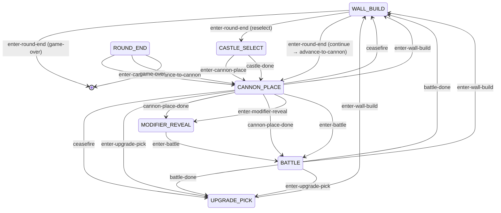

# Runtime phase-transition graph

<!-- GENERATED by scripts/gen-phase-graph.ts — DO NOT EDIT.
     Regenerate after editing src/runtime/phase-machine.ts:
       deno run -A scripts/gen-phase-graph.ts -->

Derived from the `TRANSITIONS` table in [`src/runtime/phase-machine.ts`](../src/runtime/phase-machine.ts). A review aid for the phase flow — see [runtime-invariants.md](runtime-invariants.md) (R1, R3).

## Phase flow

> Dashed/annotated `enter-round-end` exits route through `ctx.lifeLostRoute` handlers wired in `phase-ticks.ts` (`exitRoundEnd`) — **declared, not derived** from the machine. Verify those manually.

## Transitions

### `enter-round-end`

- **guard (from):** `WALL_BUILD`
- **enters phase:** ROUND_END
- **engine ops:** `finalizeRound`, `enterRoundEndPhase`
- **broadcasts:** `buildEnd`
- **display:** —
- **dispatches:** —
- **external dispatchers:** `phase-ticks.ts:857`

### `battle-done`

- **guard (from):** `BATTLE`
- **enters phase:** — (prep; routes onward)
- **engine ops:** `finalizeBattle`, `describeModifierResolution`, `prepareNextRound`
- **broadcasts:** `buildStart`
- **display:** —
- **dispatches:** `enter-upgrade-pick`, `enter-wall-build`
- **external dispatchers:** `phase-ticks.ts:788`

### `ceasefire`

- **guard (from):** `CANNON_PLACE`
- **enters phase:** — (prep; routes onward)
- **engine ops:** —
- **broadcasts:** `buildStart`
- **display:** —
- **dispatches:** `enter-upgrade-pick`, `enter-wall-build`
- **external dispatchers:** `phase-ticks.ts:353`

### `enter-upgrade-pick`

- **guard (from):** `BATTLE`, `CANNON_PLACE`
- **enters phase:** UPGRADE_PICK
- **engine ops:** `enterUpgradePickPhase`
- **broadcasts:** —
- **display:** `banner(upgrade-pick)`
- **dispatches:** `enter-wall-build`
- **external dispatchers:** —

### `enter-wall-build`

- **guard (from):** `BATTLE`, `CANNON_PLACE`, `UPGRADE_PICK`
- **enters phase:** WALL_BUILD
- **engine ops:** `enterWallBuildPhase`
- **broadcasts:** —
- **display:** `banner(build)`
- **dispatches:** —
- **external dispatchers:** `phase-ticks.ts:655 (via finishUpgradePick)`, `phase-ticks.ts:660 (via finishUpgradePick)`

### `enter-cannon-place`

- **guard (from):** `CASTLE_SELECT`, `ROUND_END`
- **enters phase:** CANNON_PLACE
- **engine ops:** `enterCannonPhase`
- **broadcasts:** —
- **display:** `banner(cannon-place)`
- **dispatches:** —
- **external dispatchers:** —

### `castle-done`

- **guard (from):** `CASTLE_SELECT`
- **enters phase:** — (prep; routes onward)
- **engine ops:** `finalizeRoundCleanup`, `finalizeFreshCastles`, `finalizeCastleConstruction`
- **broadcasts:** `cannonStart`
- **display:** —
- **dispatches:** `enter-cannon-place`
- **external dispatchers:** `phase-ticks.ts:336`

### `advance-to-cannon`

- **guard (from):** `ROUND_END`
- **enters phase:** — (prep; routes onward)
- **engine ops:** `finalizeRoundCleanup`
- **broadcasts:** `cannonStart`
- **display:** —
- **dispatches:** `enter-cannon-place`
- **external dispatchers:** `phase-ticks.ts:332`

### `game-over`

- **guard (from):** `ROUND_END`
- **enters phase:** — (prep; routes onward)
- **engine ops:** —
- **broadcasts:** —
- **display:** —
- **dispatches:** —
- **external dispatchers:** `phase-ticks.ts:340`

### `cannon-place-done`

- **guard (from):** `CANNON_PLACE`
- **enters phase:** — (prep; routes onward)
- **engine ops:** `prepareBattle`
- **broadcasts:** `battleStart`
- **display:** —
- **dispatches:** `enter-modifier-reveal`, `enter-battle`
- **external dispatchers:** `phase-ticks.ts:356`

### `enter-modifier-reveal`

- **guard (from):** `CANNON_PLACE`
- **enters phase:** MODIFIER_REVEAL
- **engine ops:** `enterModifierRevealPhase`
- **broadcasts:** —
- **display:** `banner(modifier-reveal)`
- **dispatches:** —
- **external dispatchers:** —

### `enter-battle`

- **guard (from):** `CANNON_PLACE`, `MODIFIER_REVEAL`
- **enters phase:** BATTLE
- **engine ops:** `enterBattlePhase`
- **broadcasts:** —
- **display:** `banner(battle)`
- **dispatches:** —
- **external dispatchers:** `phase-ticks.ts:634`

## Review hints (auto-derived)

- **Phases entered only from outside the machine:** `CASTLE_SELECT` — these are entered by a subsystem (e.g. `selection`), not by any `enter*Phase` inside `phase-machine.ts`. Confirm their entry path.
- **Transitions with no tick-driven dispatcher in `phase-ticks.ts`:** `enter-upgrade-pick`, `enter-cannon-place`, `enter-modifier-reveal` — reached only via another transition's postDisplay (inline routing).

